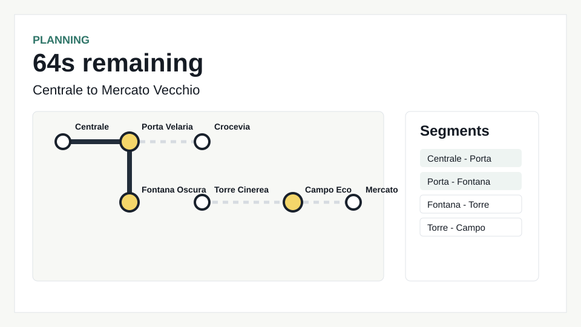
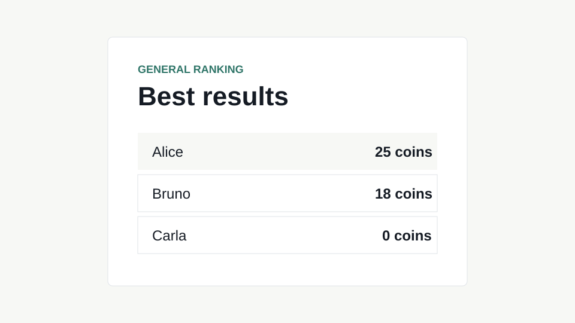

# Exam #1: "Last Race"
## Student: s123456 LASTNAME FIRSTNAME

## React Client Application Routes

- Route `/`: public instructions page. Anonymous visitors can read the rules but cannot see the network map or play.
- Route `/login`: login form for registered users.
- Route `/game`: protected game flow with setup, planning, execution, and result phases.
- Route `/ranking`: protected general ranking page showing each user's best completed score.

## API Server

- GET `/api/sessions/current`: returns `{ user }`, or `{ user: null }` if anonymous.
- POST `/api/sessions`: authenticates `{ email, password }` with Passport local strategy and starts a session.
- DELETE `/api/sessions/current`: logs out the current user and destroys the session.
- GET `/api/network`: protected endpoint returning the full fixed network, lines, station coordinates, and segments for setup.
- POST `/api/games`: protected endpoint creating a new game with random reachable start/destination at distance >= 3; returns planning data.
- POST `/api/games/:id/route`: protected endpoint validating the submitted route and returning execution events, coin updates, and final score.
- GET `/api/ranking`: protected endpoint returning users ordered by their best completed game score.

## Database Tables

- Table `users`: registered users, emails, display names, salts, and password hashes.
- Table `stations`: fixed underground stations with display coordinates.
- Table `lines`: metro line names and colors.
- Table `line_stations`: ordered many-to-many relation between lines and stations.
- Table `events`: possible journey events and coin effects from -4 to +4.
- Table `games`: game attempts, assigned stations, submitted route, execution events, status, and final score.
- Table `sessions`: created by `connect-sqlite3` for Passport session persistence.

## Main React Components

- `App` in `client/src/App.jsx`: configures application routes.
- `Layout` in `client/src/components/Layout.jsx`: top navigation, login/logout controls, and page shell.
- `Instructions` in `client/src/pages/Instructions.jsx`: public rules page.
- `Game` in `client/src/pages/Game.jsx`: coordinates setup, planning timer, route construction, execution, and result.
- `NetworkMap` in `client/src/pages/game/NetworkMap.jsx`: SVG rendering of the network or planning map.
- `Ranking` in `client/src/pages/Ranking.jsx`: displays best scores.

## Screenshot

## Users Credentials

- alice@example.com, password
- bruno@example.com, password
- carla@example.com, password

## Use of AI Tools

AI assistance was used to implement and refine this project from the exam specification, including server API design, React component structure, and validation logic. The generated output was checked with `npm run lint`, `npm run build`, Node syntax checks, and a runtime SQLite seed import.
